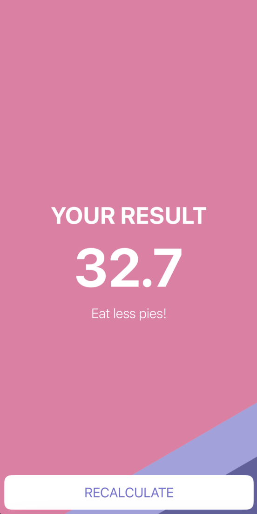

#  BMI Calculator

### A simple iOS/iPadOS applicaton that helps you to calculate your BMI

## Used technologies and tools

- Swift
- UIKit
- MVC design pattern

*This project was developed as part of The Complete iOS App Development Bootcamp by London App Brewery*

*Minimum supported OS version is 13.0*

## Illustrations

### Start screen:

### First variant of result screen

### Second variant of result screen

### Third variant of result screen

